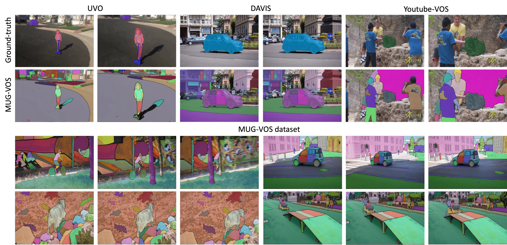

<div align="center">
<h1>Multi-Granularity Video Object Segmentation</h1>

[**Sangbeom Lim**](https://sangbeomlim.github.io/)<sup>1\*</sup> · [**Seongchan Kim**](https://github.com/deep-overflow)<sup>1\*</sup> · [**Seungjun An**](https://github.com/ansj02)<sup>3\*</sup> · [**Seokju Cho**](https://seokju-cho.github.io/)<sup>2</sup> · [**Paul Hongsuck Seo**](https://phseo.github.io/)<sup>1&dagger;</sup> . [**Seungryong Kim**](https://cvlab.korea.ac.kr)<sup>2&dagger;</sup>

<sup>1</sup>Korea University&emsp;&emsp;&emsp;&emsp;<sup>2</sup>KAIST&emsp;&emsp;&emsp;&emsp;<sup>3</sup>Samgsung Electronics

*: Equal Contribution <br>
&dagger;: Co-Corresponding Authors

**AAAI 2025**

<a href="https://arxiv.org/abs/2412.01471"></a>
<a href="https://cvlab-kaist.github.io/MUG-VOS/"></a>
</div>

<!--
<p float='center'></p>
<span style="color: green; font-size: 1.3em; font-weight: bold;">LocoTrack is an incredibly efficient model,</span> enabling near-dense point tracking in real-time. It is <span style="color: red; font-size: 1.3em; font-weight: bold;">6x faster</span> than the previous state-of-the-art models.


## 📰 News
* **2024-07-22:** [LocoTrack](https://github.com/KU-CVLAB/locotrack/) is released.
* **2024-08-03:** PyTorch inference and training code released.
* **2024-08-05:** [Interactive demo](https://huggingface.co/spaces/hamacojr/LocoTrack) released.

**Please stay tuned for an easy-to-use API for LocoTrack, coming soon!**
-->

## 📚 Citing this Work
Please use the following bibtex to cite our work:
```
@misc{lim2024multigranularityvideoobjectsegmentation,
      title={Multi-Granularity Video Object Segmentation}, 
      author={Sangbeom Lim and Seongchan Kim and Seungjun An and Seokju Cho and Paul Hongsuck Seo and Seungryong Kim},
      year={2024},
      eprint={2412.01471},
      archivePrefix={arXiv},
      primaryClass={cs.CV},
      url={https://arxiv.org/abs/2412.01471}, 
}
```

## 🙏 Acknowledgement
This project is largely based on the [XMem repository](https://github.com/hkchengrex/XMem). Thanks to the authors for their invaluable work and contributions.
